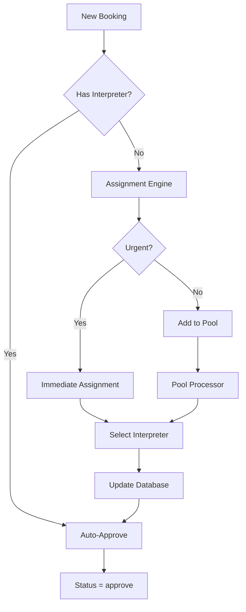
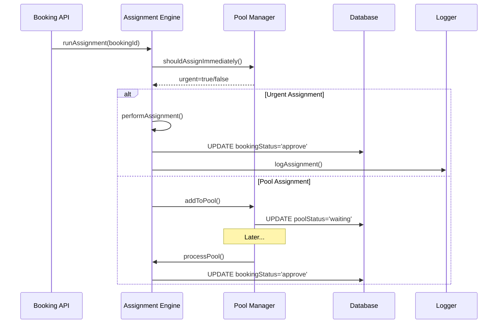

# Koro GuideBook - Auto Approve

## Cover & Summary

The auto-approve system automatically sets `bookingStatus = 'approve'` when an interpreter is assigned to a booking. This system works with the auto-assignment engine to ensure bookings are properly approved when interpreters are selected.

**Key Ideas:**
- Auto-approve happens when `interpreterEmpCode` is assigned
- Business rule: interpreter assignment = automatic approval
- Works with assignment modes (URGENT, BALANCE, NORMAL, CUSTOM)
- Uses utility functions to ensure consistency
- Integrates with pool processing and scheduling
- Logs all approval events for tracking
- Handles both immediate and pooled assignments
- Supports manual and automatic assignment flows

## Table of Contents

1. [System Map (High Level)](#system-map-high-level)
2. [Entry Points (Start Here)](#entry-points-start-here)
3. [Step-by-Step Flow (0 → 100)](#step-by-step-flow-0--100)
4. [Schedulers & Triggers](#schedulers--triggers)
5. [Config & Environment](#config--environment)
6. [Data Model](#data-model)
7. [APIs & Endpoints](#apis--endpoints)
8. [Logging & Metrics](#logging--metrics)
9. [Scoring & Rules](#scoring--rules)
10. [Gotchas (Important!)](#gotchas-important)
11. [Debug Cookbook](#debug-cookbook)
12. [Change Guide](#change-guide)
13. [Tests & Examples](#tests--examples)
14. [Glossary](#glossary)
15. [FAQ](#faq)

## System Map (High Level)

The auto-approve system has these main parts:

**Core Files:**
```
lib/
├── utils.ts                    # Business rule utility
├── assignment/
│   ├── run.ts                 # Main assignment engine
│   ├── pool.ts                # Pool management
│   ├── policy.ts              # Assignment policies
│   └── logging.ts             # Event logging
app/api/booking-data/post-booking-data/route.ts  # Booking creation
```

**Flow Diagram:**


## Entry Points (Start Here)

### 1. Booking Creation Entry Point
**File:** `app/api/booking-data/post-booking-data/route.ts`
**Function:** `POST` handler
**Job:** Creates new bookings and triggers auto-assignment
**Lines:** 894+ (main function at end)

### 2. Assignment Engine Entry Point  
**File:** `lib/assignment/run.ts`
**Function:** `runAssignment(bookingId: number)`
**Job:** Main assignment logic that triggers auto-approve
**Lines:** 95-180

### 3. Pool Processing Entry Point
**File:** `lib/assignment/run.ts` 
**Function:** `processPool()`
**Job:** Processes pooled bookings for assignment
**Lines:** 182-320

### 4. Business Rule Utility
**File:** `lib/utils.ts`
**Function:** `ensureBookingStatusOnAssignment(data)`
**Job:** Ensures auto-approve rule is followed
**Lines:** 13-25

## Step-by-Step Flow (0 → 100)

### Happy Path (Success)

**Step 1: Booking Creation**
- **Where:** `app/api/booking-data/post-booking-data/route.ts` line 894+
- **What:** New booking created via API
- **Next:** Calls auto-assignment if no interpreter specified

**Step 2: Assignment Check**
- **Where:** `lib/assignment/run.ts` line 95 (`runAssignment`)
- **What:** Checks if booking needs assignment
- **Next:** Determines if urgent or should go to pool

**Step 3: Urgency Decision**
- **Where:** `lib/assignment/pool.ts` line 1200+ (`shouldAssignImmediately`)
- **What:** Decides immediate assignment vs pool
- **Next:** Either immediate assignment or pool entry

**Step 4: Interpreter Selection**
- **Where:** `lib/assignment/run.ts` line 400+ (`performAssignment`)
- **What:** Finds best interpreter using scoring
- **Next:** Database update with interpreter

**Step 5: Auto-Approve Trigger**
- **Where:** `lib/assignment/run.ts` line 987-990
- **What:** Updates database with interpreter AND approve status
- **Code:**
```typescript
data: {
  interpreterEmpCode: candidate.empCode,
  bookingStatus: 'approve'
}
```

**Step 6: Logging**
- **Where:** `lib/assignment/logging.ts` (various functions)
- **What:** Records assignment and approval events
- **Next:** Process complete

### Error Path (Failures)

**Step 1: Assignment Failure**
- **Where:** `lib/assignment/run.ts` line 600+ (error handling)
- **What:** No suitable interpreter found
- **Result:** Status remains 'waiting', escalated for manual review

**Step 2: Pool Timeout**
- **Where:** `lib/assignment/pool.ts` deadline processing
- **What:** Booking deadline passed without assignment
- **Result:** Emergency processing or escalation

**Sequence Diagram:**


## Schedulers & Triggers

### 1. Pool Processor Schedule
**File:** `lib/assignment/pool.ts`
**Function:** `processPool()`
**Trigger:** Called by cron job or manual trigger
**Frequency:** Every 5-15 minutes (configurable)

### 2. Assignment Triggers
**Immediate Triggers:**
- New booking creation (if urgent)
- Manual assignment request
- Pool deadline reached

**Scheduled Triggers:**
- Pool processing batches
- Deadline emergency processing
- System load evaluation

### 3. Auto-Approval Triggers
**File:** `lib/assignment/run.ts` line 987
**When:** Every time `interpreterEmpCode` is set
**Rule:** Always sets `bookingStatus = 'approve'`

## Config & Environment

### 1. Assignment Policy Config
**File:** `lib/assignment/policy.ts`
**Table:** `AUTO_ASSIGNMENT_CONFIG`
**Key Settings:**
- `autoAssignEnabled`: Enable/disable system
- `mode`: URGENT, BALANCE, NORMAL, CUSTOM
- `fairnessWindowDays`: Fairness calculation period
- `maxGapHours`: Maximum hour gap between interpreters

### 2. Meeting Type Priorities
**File:** `lib/assignment/policy.ts`
**Table:** `MEETING_TYPE_PRIORITY`
**Settings:**
- `urgentThresholdDays`: Days before urgent assignment
- `generalThresholdDays`: Days before pool deadline
- `priorityValue`: Meeting importance score

### 3. Environment Variables
**Read in:** Various assignment files
**Key Variables:**
- Database connection settings
- Logging levels
- Pool processing intervals

## Data Model

### 1. BookingPlan Table
**Key Fields for Auto-Approve:**
- `interpreterEmpCode`: Assigned interpreter (NULL = unassigned)
- `bookingStatus`: approve/waiting/cancel/complet
- `poolStatus`: waiting/processing/ready/failed
- `poolDeadlineTime`: When assignment must complete

### 2. Assignment Log Table
**File:** `lib/assignment/logging.ts`
**Purpose:** Track all assignment and approval events
**Key Fields:**
- `bookingId`: Which booking
- `interpreterEmpCode`: Who was assigned
- `status`: assigned/escalated/pooled
- `reason`: Why this happened

### 3. Auto Assignment Config Table
**Purpose:** Store assignment policies and modes
**Key Fields:**
- `mode`: Current assignment mode
- `autoAssignEnabled`: System on/off switch
- Scoring weights and thresholds

## APIs & Endpoints

### 1. Create Booking
**Route:** `POST /api/booking-data/post-booking-data`
**Purpose:** Create new booking, trigger auto-assignment
**Handler:** `app/api/booking-data/post-booking-data/route.ts`
**Auto-Approve:** Happens after assignment completes

### 2. Assignment Status
**Purpose:** Check assignment and approval status
**Response includes:** Current booking status, interpreter assigned

### 3. Pool Management
**Purpose:** Monitor and control pool processing
**Triggers:** Pool processing that leads to auto-approve

## Logging & Metrics

### 1. Assignment Logs
**File:** `lib/assignment/logging.ts`
**Function:** `logAssignment()`
**What:** Records when auto-approve happens
**Lines:** Various logging functions

### 2. Log Messages for Auto-Approve
```
✅ Booking {bookingId} assigned to {interpreterEmpCode} with auto-approve
📊 Assignment completed: status=assigned, approved=true
🎯 Auto-approve triggered by interpreter assignment
```

### 3. Tracing a Request
**Step 1:** Find booking ID in logs
**Step 2:** Search for assignment events
**Step 3:** Look for auto-approve confirmation
**Step 4:** Check final status update

## Scoring & Rules

### 1. Core Business Rule
**File:** `lib/utils.ts` lines 13-25
**Rule:** When `interpreterEmpCode` is assigned, `bookingStatus` MUST be 'approve'
**Formula:**
```typescript
if (interpreterEmpCode !== null) {
  bookingStatus = "approve"
}
```

### 2. Assignment Scoring
**File:** `lib/assignment/run.ts`
**Purpose:** Select best interpreter
**Result:** Triggers auto-approve when interpreter chosen

### 3. Mode-Specific Rules
**URGENT Mode:** Immediate assignment and approval
**BALANCE Mode:** Batch processing, then approval
**NORMAL Mode:** Standard assignment flow
**CUSTOM Mode:** User-defined parameters

## Gotchas (Important!)

### 1. Manual Assignment Bypass
**Problem:** Manual assignment might skip auto-approve
**Solution:** Always use `ensureBookingStatusOnAssignment()` utility
**File:** `lib/utils.ts` lines 13-25

### 2. Pool Processing Delays
**Problem:** Pooled bookings not approved until processed
**Symptom:** Booking has interpreter but status still 'waiting'
**Fix:** Check pool processing schedule and deadlines

### 3. Transaction Rollbacks
**Problem:** Assignment succeeds but approval fails
**Symptom:** Interpreter assigned but status not updated
**Fix:** Use database transactions for atomic updates

### 4. Concurrent Assignment
**Problem:** Multiple assignments for same booking
**Symptom:** Duplicate approvals or conflicts
**Fix:** Use database locks during assignment

## Debug Cookbook

### If Auto-Approve Not Working

**Check 1: Business Rule Applied**
```bash
rg -n "ensureBookingStatusOnAssignment" lib/
```

**Check 2: Assignment Completion**
```bash
rg -n "interpreterEmpCode.*bookingStatus.*approve" lib/
```

**Check 3: Database Updates**
```sql
SELECT bookingId, interpreterEmpCode, bookingStatus, updated_at 
FROM BOOKING_PLAN 
WHERE bookingId = [YOUR_BOOKING_ID]
ORDER BY updated_at DESC;
```

### Search Commands

**Find Auto-Approve Code:**
```bash
rg -n "bookingStatus.*approve" lib/
rg -n "auto.*approve|approve.*auto" .
```

**Find Assignment Logic:**
```bash
rg -n "runAssignment|performAssignment" lib/
rg -n "interpreterEmpCode" lib/assignment/
```

**Find Pool Processing:**
```bash
rg -n "processPool|poolStatus" lib/
rg -n "deadline|urgent" lib/assignment/
```

### Debugging Steps

**Step 1:** Check if booking exists and needs assignment
**Step 2:** Verify assignment engine is enabled
**Step 3:** Check pool status and deadlines
**Step 4:** Look for assignment completion logs
**Step 5:** Verify database transaction completed

## Change Guide

### How to Change Auto-Approve Rule

**Current Rule:** Assignment = Approval
**To Change:**
1. Edit `lib/utils.ts` lines 13-25
2. Update business logic in `ensureBookingStatusOnAssignment()`
3. Test with existing assignment flows
4. Update documentation

### How to Add New Approval Conditions

**Step 1:** Identify trigger points in assignment flow
**Step 2:** Add condition checks before approval
**Step 3:** Update utility function logic
**Step 4:** Test all assignment modes

### What to Test After Changes

- [ ] Manual assignment still triggers approval
- [ ] Pool processing approves correctly  
- [ ] All assignment modes work
- [ ] Error cases don't break approval
- [ ] Logging captures new behavior

## Tests & Examples

### Unit Test Example
**File:** `scripts/test-booking-status.js`
**Purpose:** Verify auto-approve business rule
**Test Steps:**
1. Create booking with status 'waiting'
2. Trigger assignment
3. Verify status changed to 'approve'
4. Clean up test data

### Integration Test
**Purpose:** Test full assignment to approval flow
**Steps:**
1. Create booking via API
2. Wait for assignment processing
3. Check final status is 'approve'
4. Verify interpreter assigned

### Sample Input/Output

**Input:** New booking without interpreter
```json
{
  "meetingType": "DR",
  "timeStart": "2025-09-04 10:00:00",
  "timeEnd": "2025-09-04 11:00:00",
  "interpreterEmpCode": null
}
```

**Output:** Assigned and approved booking
```json
{
  "bookingId": 123,
  "interpreterEmpCode": "EMP001", 
  "bookingStatus": "approve",
  "assignedAt": "2025-09-03T14:30:00Z"
}
```

## Glossary

**Auto-Approve:** Automatic setting of booking status to 'approve' when interpreter assigned

**Assignment Engine:** System that selects interpreters for bookings

**Booking Status:** Current state of booking (waiting/approve/cancel/complet)

**Pool:** Storage for non-urgent bookings waiting for assignment

**Business Rule:** When interpreter assigned, status must be 'approve'

**Interpreter EmpCode:** Employee code of assigned interpreter

**Urgency Score:** Number showing how urgent a booking assignment is

**Mode:** Assignment strategy (URGENT/BALANCE/NORMAL/CUSTOM)

**Fairness:** Equal distribution of work among interpreters

**Threshold Days:** Days before meeting when assignment becomes urgent

## FAQ

**Q: When does auto-approve happen?**
A: Every time an interpreter is assigned to a booking.

**Q: Can I assign interpreter without approval?**
A: No. The business rule always sets status to 'approve' when interpreter assigned.

**Q: What if assignment fails?**
A: Booking stays in 'waiting' status until manual review or retry.

**Q: How do I check if auto-approve worked?**
A: Look for `bookingStatus = 'approve'` and `interpreterEmpCode` not null.

**Q: Can I change the auto-approve rule?**
A: Yes, edit the `ensureBookingStatusOnAssignment()` function in `lib/utils.ts`.

**Q: What happens with pooled bookings?**
A: They get approved when pool processor assigns an interpreter.

**Q: How do I debug approval problems?**
A: Check assignment logs, database status, and pool processing.

**Q: Does mode affect auto-approve?**
A: No. All modes trigger auto-approve when interpreter assigned.

**Q: What about manual assignments?**
A: Use the utility function to ensure auto-approve happens.

**Q: Can approval happen without assignment?**
A: No. The system only approves when interpreter is assigned.

**Q: How do I test auto-approve?**
A: Run `scripts/test-booking-status.js` or create test booking via API.

**Q: What if database update fails?**
A: Assignment and approval happen in same transaction, so both fail together.