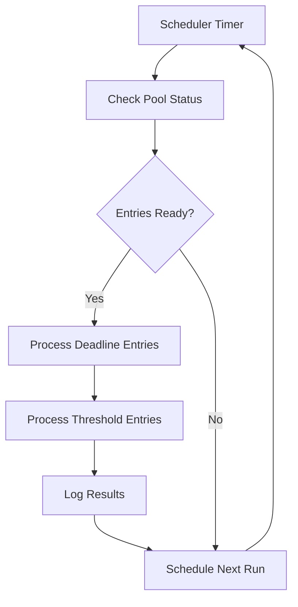

# Pool Processing Execution Fix Implementation

This document describes the implementation of Task 2: "Implement Pool Processing Execution Fix" from the auto-assignment critical fixes specification.

## Overview

The pool processing execution fix addresses the critical issue where bookings were being added to the pool but never processed for assignment. This implementation provides:

1. **Scheduled Pool Processing Service** - Automated processing at regular intervals
2. **Pool Entry Threshold Monitoring** - Identifies ready-for-processing bookings
3. **Deadline Processing Logic** - Handles bookings approaching assignment deadlines
4. **Pool Processing Execution Engine** - Actually assigns interpreters to ready bookings
5. **Comprehensive Logging** - Logs all activities to POOL_PROCESSING_LOG table

## Implementation Components

### 1. Pool Processing Scheduler (`lib/assignment/pool-scheduler.ts`)

**Purpose**: Provides scheduled, automated pool processing at configurable intervals.

**Key Features**:
- Configurable processing intervals based on assignment mode
- Retry logic with exponential backoff
- Error handling and recovery
- Manual processing triggers
- Status monitoring and health checks

**Usage**:
```typescript
import { startPoolScheduler, stopPoolScheduler, processPoolNow } from '@/lib/assignment/pool-scheduler';

// Start scheduler with default interval
startPoolScheduler();

// Start with custom interval (5 minutes)
startPoolScheduler(5 * 60 * 1000);

// Manual processing
await processPoolNow();

// Stop scheduler
stopPoolScheduler();
```

**Processing Intervals by Mode**:
- URGENT mode: 5 minutes
- BALANCE mode: 15 minutes  
- NORMAL/CUSTOM mode: 30 minutes

### 2. Pool Processing Engine (`lib/assignment/pool-engine.ts`)

**Purpose**: Core engine that handles different types of pool processing with detailed monitoring.

**Key Features**:
- Threshold-based processing
- Deadline-based processing
- Emergency processing override
- Detailed result tracking
- Urgency level classification

**Processing Types**:

#### Threshold Processing
Processes entries that have reached their configured threshold time:
```typescript
const engine = getPoolProcessingEngine();
const results = await engine.processReadyEntries();
```

#### Deadline Processing
Processes entries approaching or past their assignment deadline:
```typescript
const results = await engine.processDeadlineEntries();
```

#### Emergency Processing
Immediately processes ALL pooled entries regardless of thresholds:
```typescript
const results = await engine.processEmergencyOverride();
```

### 3. System Startup Integration (`lib/assignment/startup.ts`)

**Purpose**: Initializes the pool processing system when the application starts.

**Features**:
- Automatic scheduler initialization
- Database schema validation
- Health monitoring
- Graceful degradation on errors

**Usage**:
```typescript
import { initializeAssignmentSystem } from '@/lib/assignment/startup';

// Initialize on app startup
await initializeAssignmentSystem();
```

### 4. API Endpoints

#### Pool Processing Control
- `POST /api/admin/pool/process` - Manual pool processing
- `GET /api/admin/pool/process` - Get pool status

#### Scheduler Control  
- `POST /api/admin/pool/scheduler` - Control scheduler (start/stop/restart)
- `GET /api/admin/pool/scheduler` - Get scheduler status

#### Emergency Processing
- `POST /api/admin/pool/emergency` - Emergency processing override
- `GET /api/admin/pool/emergency` - Emergency processing recommendations

#### System Health
- `POST /api/system/startup` - Initialize system
- `GET /api/system/startup` - System health check

## Database Schema

The implementation uses the existing `POOL_PROCESSING_LOG` table for comprehensive logging:

```sql
CREATE TABLE POOL_PROCESSING_LOG (
  ID INT PRIMARY KEY AUTO_INCREMENT,
  BATCH_ID VARCHAR(64),
  MODE VARCHAR(32),
  PROCESSING_START_TIME DATETIME,
  PROCESSING_END_TIME DATETIME,
  TOTAL_ENTRIES INT,
  PROCESSED_ENTRIES INT,
  ASSIGNED_ENTRIES INT,
  ESCALATED_ENTRIES INT,
  FAILED_ENTRIES INT,
  FAIRNESS_IMPROVEMENT FLOAT,
  AVERAGE_PROCESSING_TIME_MS INT,
  SYSTEM_LOAD VARCHAR(16),
  ERRORS JSON,
  PERFORMANCE JSON,
  created_at TIMESTAMP DEFAULT CURRENT_TIMESTAMP
);
```

## Processing Flow

### 1. Scheduled Processing Flow



### 2. Entry Processing Priority

1. **CRITICAL** - Past deadline or within 2 hours
2. **HIGH** - Within 6 hours of deadline
3. **MEDIUM** - Within 24 hours of deadline
4. **LOW** - Normal threshold processing

### 3. Mode-Specific Processing

#### URGENT Mode
- Process immediately when added to pool
- 5-minute scheduler intervals for cleanup
- Priority: Deadline > Ready > Pending

#### BALANCE Mode  
- Wait for threshold or batch optimization
- 15-minute scheduler intervals
- Batch processing for fairness optimization
- Emergency processing for critical entries

#### NORMAL/CUSTOM Mode
- Standard threshold-based processing
- 30-minute scheduler intervals
- Individual entry processing

## Monitoring and Logging

### Pool Processing Logs
Every processing batch creates detailed logs including:
- Batch ID and processing mode
- Entry counts (total, assigned, escalated, failed)
- Processing times and performance metrics
- Error details and system load indicators
- Fairness improvement metrics (for Balance mode)

### System Health Monitoring
- Database connectivity checks
- Scheduler status monitoring
- Processing error tracking
- Performance metrics collection

### Error Handling
- Retry logic with exponential backoff
- Error isolation (individual entry failures don't block batch)
- Graceful degradation on system failures
- Comprehensive error logging

## Testing

### Manual Testing
1. Start the application: `npm run dev`
2. Run API tests: `node scripts/test-pool-api.js`
3. Check system health: `GET /api/system/startup`
4. Monitor scheduler: `GET /api/admin/pool/scheduler`

### API Testing Examples

```bash
# Initialize system
curl -X POST http://localhost:3000/api/system/startup

# Check pool status
curl http://localhost:3000/api/admin/pool/process

# Manual processing
curl -X POST http://localhost:3000/api/admin/pool/process

# Emergency processing
curl -X POST http://localhost:3000/api/admin/pool/emergency

# Start scheduler
curl -X POST http://localhost:3000/api/admin/pool/scheduler \
  -H "Content-Type: application/json" \
  -d '{"action": "initialize"}'
```

## Configuration

### Environment Variables
No additional environment variables required - uses existing database configuration.

### Policy-Based Configuration
Processing intervals automatically adjust based on the current assignment policy mode:

```typescript
// From AutoAssignmentConfig table
{
  mode: 'BALANCE',        // Affects processing interval
  fairnessWindowDays: 30, // Used in processing logic
  maxGapHours: 10        // Used in assignment decisions
}
```

## Performance Considerations

### Batch Processing
- Balance mode uses batch processing for fairness optimization
- Configurable batch sizes (default: 10, emergency: 15)
- Individual entry processing for other modes

### Database Operations
- Efficient pool queries with proper indexing
- Batch logging to reduce database load
- Connection pooling and retry logic

### Memory Management
- Singleton pattern for scheduler and engine instances
- Proper cleanup on shutdown
- Limited error history retention (last 10 errors)

## Troubleshooting

### Common Issues

1. **Scheduler Not Starting**
   - Check database connectivity
   - Verify system initialization
   - Check for existing scheduler instances

2. **Pool Entries Not Processing**
   - Verify entries are actually ready (check thresholds)
   - Check scheduler status and errors
   - Review processing logs

3. **High Processing Failures**
   - Check database connectivity
   - Review interpreter availability
   - Check assignment policy configuration

### Debug Commands

```bash
# Check system health
curl http://localhost:3000/api/system/startup

# Get detailed pool status
curl http://localhost:3000/api/admin/pool/process

# Check scheduler errors
curl http://localhost:3000/api/admin/pool/scheduler

# Force emergency processing
curl -X POST http://localhost:3000/api/admin/pool/emergency
```

## Requirements Fulfilled

This implementation addresses all requirements from Task 2:

✅ **1.1** - Pool entries are processed when they reach thresholds  
✅ **1.2** - Pool processing actually assigns interpreters to ready bookings  
✅ **1.3** - Results are logged to POOL_PROCESSING_LOG table  
✅ **1.4** - Bookings at deadline are assigned immediately  

### Additional Features Implemented

- **Retry Logic** - Exponential backoff for failed processing
- **Emergency Processing** - Manual override for urgent situations  
- **Health Monitoring** - System status and error tracking
- **API Control** - Manual triggers and status monitoring
- **Mode-Specific Processing** - Different strategies per assignment mode
- **Performance Metrics** - Detailed timing and success rate tracking

## Future Enhancements

1. **Advanced Scheduling** - Cron-like scheduling expressions
2. **Load Balancing** - Distributed processing for high-volume systems
3. **Predictive Processing** - ML-based threshold optimization
4. **Real-time Notifications** - Alerts for processing failures
5. **Dashboard Integration** - Visual monitoring interface

## Conclusion

The Pool Processing Execution Fix provides a robust, scalable solution for automated pool processing with comprehensive monitoring, error handling, and manual control capabilities. The implementation ensures that pooled bookings are reliably processed according to their thresholds and deadlines, resolving the critical issue where bookings remained stuck in the pool indefinitely.